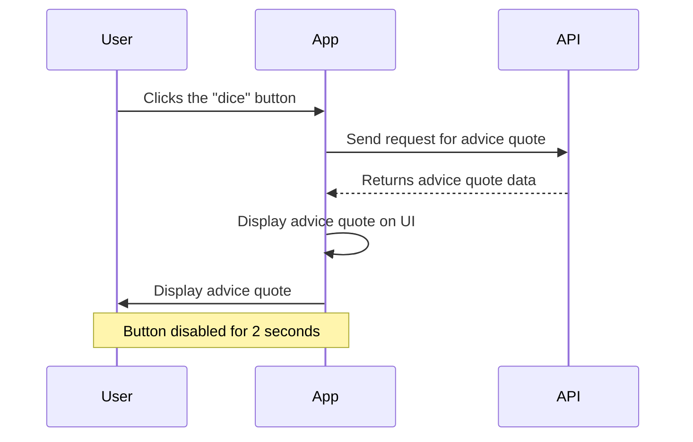

# Frontend Mentor - Advice Generator App Solution

## Table of Contents

- [Preview](#preview)
- [Introduction](#introduction)
- [Built Using](#built-using)
- [Features](#features)
- [How to Use](#how-to-use)
- [Sequence Diagram](#sequence-diagram)
- [Acknowledgements](#acknowledgements)
- [License](#license)

## Preview

## Introduction

This project, the "Advice Generator App," was developed as part of a Frontend Mentor assignment to enhance my skills in HTML, SASS, and JavaScript. The app provides an interactive interface that allows the user to generate random advice quotes, offering them with quick and insightful advices, which are fetched from the [Advice Slip API](https://api.adviceslip.com).

## Built Using

## Features

- **Random Advice Quotes**: Users can generate random advice quotes by clicking the dice icon.

- **Usage of Advice Slip API**: The app seamlessly integrates the [Advice Slip API](https://api.adviceslip.com) to fetch and display the dynamic advice content.

- **Hover States**: All interactive elements have hover states to enhance the user experience.

- **User-Friendly Interface**: The app offers an intuitive and responsive interface suitable for various device screen sizes.

## How to Use

1. Access the live demo [here](https://maorbezalel.github.io/advice-generator-app/).
2. Click the "dice" button to generate a random advice quote.
3. The advice quote, as well as its ID, will appear inside the advice card.
4. To prevent spamming, the button will be disabled for a short time (2 seconds) after generating an advice.
5. Gain valuable insights and a touch of wisdom with every click! 🎲📜

## Sequence Diagram

The following sequence diagram illustrates the interaction between the user, the app, and the Advice Slip API:

## Acknowledgements

- **Frontend Mentor**: For providing the challenge, design assets, and guidelines for creating this app. Explore their platform [here](https://www.frontendmentor.io/).

- **Advice Slip**: For providing the rich and easy-to-use [Advice Slip API](https://api.adviceslip.com) which forms the core of the app's functionality, generating dynamic advice quotes.

## License

This solution is based on a Frontend Mentor challenge and is subject to the terms and conditions of the [Frontend Mentor License](https://www.frontendmentor.io/license).